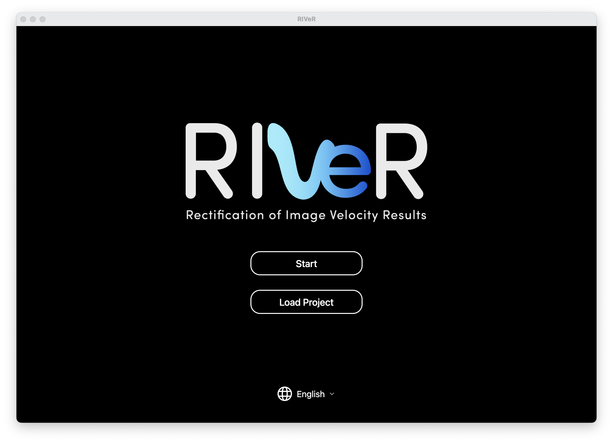

<!-- 1. Instalar Node 18.18.00 o superior
  1.1 - Instalar nvm, manejador de versiones node
  1.2 - nvm install 18.18.00
  1.3 - nvm use 18.18.00

2 - Instalar yarn
  1 - Si tienes npm, simple, npm install yarn
  2 - Si no tienes npm, via curl se puede.

3 
    - Windows: es necesario anadir la carpeta de ffmpeg essentials dentro de gui
    - Linux: es necesario tener instalado ffmpeg

4 - cd RIVeR/gui

5 - Ejecutar -> yarn

6 -> Crear archivo .env en la raiz de gui, RIVeR/gui/.env siguiendo el .env.example.

6 - Al finalizar, -> yarn dev

Listo, app corriendo. -->


## Installation

To get started with RIVeR-gui in development mode, ensure you have Node 18.18.0 or newer installed. If you have an earlier version of Node, you can change it or install another with nvm.

Additionally, ensure that FFMPEG is installed on your system. 

### Install Dependencies
```
  npm install
```
Or, If you use yarn 

```
 yarn install 
```

#### If everything going well. You can check with
```
npm run dev
```
Or
```
yarn dev
```
You should see the main page of the application running successfully in development mode.



###  Add Enviroment Variables

Finally, you need to add environment variables to ensure that RIVER-CLI integrates seamlessly with RIVER-GUI and has proper access to user files (e.g., videos, images).

To do this, create a `.env.development` file in the `gui` directory by following the example provided in:

```
gui/.env.example
```

Make sure to customize the variables in the `.env.development` file according to your setup.


