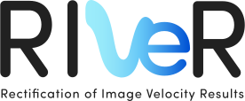

<figure>
    
</figure>
<br clear="left"/>
<br>


[](https://doi.org/10.1016/j.cageo.2017.07.009)
[](https://www.gnu.org/licenses/agpl-3.0)
[](https://www.python.org/downloads/)
[](https://reactjs.org/)

**RIVeR** (Rectification of Image Velocity Results) is a modern, open-source toolkit for Large Scale Particle Image Velocimetry (LSPIV). Built with Python and React, it provides a user-friendly interface for water-surface velocity analysis and flow discharge measurements in rivers and large-scale hydraulic models.

<figure>
    
    <figcaption>Example of RIVeR velocimetry analysis of river flow</figcaption>
</figure>

## Current capabilities
* Frame extraction
* FFT-based PIV analysis with multi-pass support
* Interactive result visualization
* CSV data import/export
* Multi-platform support

## Project Structure

```
river/
.
├── LICENSE
├── examples       # Jupyter examples
│   ├── 00_introduction.ipynb
│   ├── 01_video_to_frames.ipynb
│   ├── 02a_nadir_transformation.ipynb
│   ├── 02b_oblique_transformation.ipynb
│   ├── 03_cross_sections.ipynb
│   ├── 04_piv_analysis.ipynb
│   ├── 05_discharge_calculation.ipynb
│   ├── data
│   ├── results
│   └── utils
├── gui
├── pyproject.toml
├── readme.md
├── requirements.txt
└── river
├── cli
├── core
│   ├── compute_section.py       # Section computation utilities
│   ├── coordinate_transform.py   # Coordinate system transformations
│   ├── define_roi_masks.py      # ROI and mask definitions
│   ├── exceptions.py            # Custom exceptions
│   ├── image_preprocessing.py   # Image preparation tools
│   ├── matlab_smoothn.py        # Smoothing algorithms
│   ├── piv_fftmulti.py         # FFT-based PIV processing
│   ├── piv_loop.py             # PIV processing loop
│   ├── piv_pipeline.py         # Main PIV pipeline
│   └── video_to_frames.py      # Video frame extraction
└── docs
```

## Dependencies

### Backend Requirements

| Package               | Version   | License                 |
|----------------------|-----------|-------------------------|
| opencv-python-headless| >=4.6    | MIT License            |
| matplotlib           | >=3.8.4   | PSF License            |
| scipy                | ==1.13.1  | BSD License            |
| click                | ==8.1.7   | BSD License            |
| numba                | ==0.60.0  | BSD License            |
| tqdm                 | ==4.67.0  | MIT License            |

### Installation

You can install RIVeR's dependencies using pip:

```bash
pip install -r requirements.txt
```

Or install individual packages:

```bash
pip install opencv-python-headless>=4.6 matplotlib>=3.8.4 scipy==1.13.1 \
            click==8.1.7 numba==0.60.0 tqdm==4.67.0
```

## Citation

If you use RIVeR in your research, please cite:

```bibtex
@article{patalano2017river,
    title={Rectification of Image Velocity Results (RIVeR): A simple and user-friendly toolbox
           for large scale water surface Particle Image Velocimetry (PIV) and
           Particle Tracking Velocimetry (PTV)},
    author={Patalano, Antoine and García, Carlos Marcelo and Rodríguez, Andrés},
    journal={Computers \& Geosciences},
    volume={105},
    pages={103--114},
    year={2017},
    publisher={Elsevier}
}
```

## Authors

### Core Team
- **Antoine Patalano** - *Project Lead, Feature Development* - [UNC/ORUS]
- **Leandro Massó** - *Feature Development* - [UNC/ORUS]

### Development Team
- **Nicolas Stefani** - *CLI & Backend Development*
- **Tomas Stefani** - *Frontend Development*

## Acknowledgments

- Original MATLAB version (2017)
- UNC/ORUS research team
- Contributing organizations: UNC, ORUS, INA, CONICET
- [PIVlab project](https://la.mathworks.com/matlabcentral/fileexchange/27659-pivlab-particle-image-velocimetry-piv-tool-with-gui): The pioneering PIV analysis tool that inspired aspects of RIVeR's development

## License

RIVeR is licensed under the [GNU Affero General Public License v3.0](LICENSE) (AGPL-3.0).
